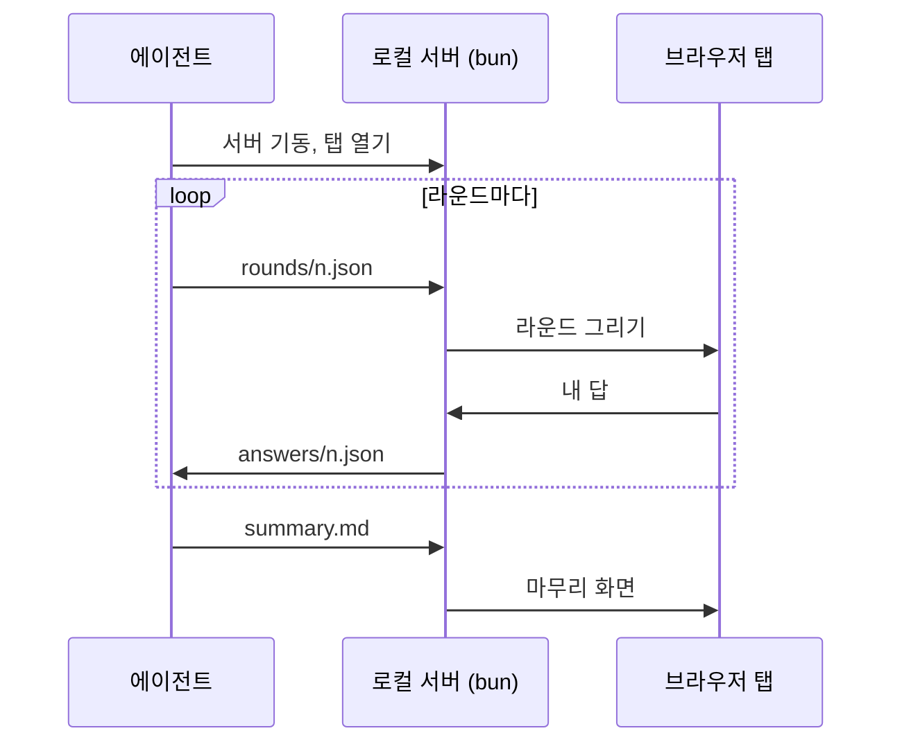

<h1 align="center">grill-web</h1>

<p align="center">
  <b>계획을 두들겨 맞는 건 터미널 말고 브라우저에서.</b><br>
  Matt Pocock의 <a href="https://github.com/mattpocock/skills/blob/main/docs/productivity/grilling.md">grilling</a> 스킬 위에 올린, Claude Code용 라운드 인터뷰 폼.
</p>

<p align="center">
  <a href="README.md">English</a> · 한국어
</p>


계획은 있는데, 아직 안 보이는 구멍이 있다. `grilling`은 아무것도 조용히 가정된 채 남지 않을 때까지 라운드마다 캐물어 그 구멍을 찾아준다. 훌륭한 스킬인데 터미널에서 답하기가 고통스럽다. Q7을 다시 읽으려고 위로 스크롤하고, Q3 답을 한 줄짜리 프롬프트에 우겨 넣고, 반복.

grill-web은 인터뷰는 그대로 두고 터미널만 치웠다. 질문이 브라우저 탭에 뜬다. 답을 클릭하고, 필요하면 메모를 달고, 보낸다. 에이전트가 다음 라운드를 짠다.

## 이런 게 됩니다

**타이핑 대신 클릭.** 예/아니요 토글, 단일 선택, 다중 선택, 숫자는 슬라이더, 정말 말이 필요할 때만 텍스트 박스. 스킬 규칙상 에이전트는 모든 질문에 추천안을 붙이고, "이대로" 한 번이면 그 답을 받는다.

**말 대신 그림으로 묻는 질문.** 에이전트가 질문 안에 mermaid 다이어그램, 나란히 비교, diff, 단계 목록, 표를 넣을 수 있다. 두 아키텍처 중 하나를 고르는 일은 둘 다 그려져 있을 때 훨씬 쉽다.

**이유를 남길 자리.** 답마다 메모를 붙일 수 있다. "예, 단 옛 URL은 다 살린다는 조건으로"도 답이고, 에이전트는 그걸 다음 라운드에 반영한다.

**컨텍스트를 가볍게.** 페이지는 한 번만 만들고 다시 만들지 않는다. 라운드마다 에이전트가 하는 일은 작은 JSON 하나 쓰고 하나 읽기라, 인터뷰가 길어져도 출력 쪽은 작게 유지된다.

**넓은 화면에 맞춘 레이아웃.** 왼쪽에 질문, 오른쪽에 답, 아래에 접힌 지난 라운드. 창이 좁으면 세로로 쌓인다.

**미뤘다가 다시.** 아직 모르겠으면 한 번 클릭으로 질문을 미룬다. 주변 답이 정해지고 나면 다음 라운드에 미뤄 둔 질문이라는 표시와 함께 다시 온다.

**가져갈 수 있다.** 언제든 세션 전체를 마크다운으로 복사한다. 스펙에, 티켓에, 다른 에이전트에 그대로 붙여 넣으면 된다.

## 빠른 시작

[Claude Code](https://claude.com/claude-code)용 스킬이다. [bun](https://bun.sh)(로컬 서버가 이 위에서 돈다)과 [grilling](https://github.com/mattpocock/skills) 스킬이 더 필요하다.

```bash
# 1. grilling, 한 번만. 둘 중 평소 쓰는 쪽으로.
npx skills@latest add mattpocock/skills --skill grilling
#    또는 Claude Code 안에서:  /plugin install mattpocock-skills

# 2. grill-web
npx skills@latest add korECM/grilling-web
#    또는 Claude Code 안에서:  /plugin marketplace add korECM/grilling-web
#                            /plugin install grill-web@grilling-web
```

그다음 Claude Code에서:

```
/grill-web 블로그를 정적 사이트로 옮기는 계획 좀 두들겨봐
```

탭이 열리고 첫 라운드가 뜬다. 답하고, 보내고, 반복. 물을 게 다 떨어지면 에이전트가 마지막으로 "이해가 같은가"를 확인하고, 예라고 하면 마무리 화면에 정리를 써 준다.

새 세션을 시작하면 이전 세션은 지워진다. 남기고 싶으면 먼저 마크다운으로 복사해 둔다.

## 어떻게 도나

grill-web은 grilling 위의 얇은 층이다. 인터뷰 로직은 손대지 않았고 채널만 바꿨다.



전부 내 컴퓨터 안에서 돈다. 상태는 `~/.cache/grill-web/`에, 서버는 4747 포트(`GRILL_WEB_PORT`, `GRILL_WEB_DIR`로 변경). 폰트와 mermaid를 받는 CDN 요청 말고는 밖으로 나가는 게 없다.

## 자주 묻는 것

**grilling이 묻는 방식이 달라지나?**
아니다. grilling을 먼저 불러와 그 규칙을 따른다. 주제를 결정 트리로 그리고, 지금 물을 수 있는 건 한 라운드에 다 묻고, 결정을 대신 내리지 않고, 뭔가 하기 전에 이해가 같은지 확인한다. grilling이 없으면 설치법을 알려주고 멈춘다.

**Claude Code 없이도 되나?**
폼과 서버는 누가 JSON을 쓰는지 신경 쓰지 않는다. SKILL.md를 읽고 셸 명령을 돌릴 수 있는 에이전트면 된다. 다만 지금까지 써 본 건 Claude Code뿐이다.

**UI 문구를 바꾸고 싶다.**
문구는 전부 `ui/index.html` 안에 있다. 인터뷰 자체는 나와 에이전트가 쓰는 언어로 진행된다.

**에이전트가 기다리다 타임아웃됐다고 한다.**
`wait` 명령은 셸 호출이 영원히 매달리지 않도록 9분 반쯤 지나면 포기한다. 답은 그대로 남아 있고, 에이전트가 `wait`를 다시 돌리면 된다.

**왜 bun인가?**
파일 하나, `package.json` 없음, 바로 뜸. Node가 필요하면 `server.ts`가 작아서 반나절이면 옮긴다.

## 속은 이렇게 생겼다

스킬을 손볼 사람을 위한 절이다. 에이전트가 쓰는 파일이고 직접 쓸 일은 없다.

```json
{
  "intro": "저장 방식부터",
  "questions": [
    {
      "n": 1,
      "title": "재시도 상태를 어디에 둘까",
      "body": [
        "지금 주문 테이블에는 상태 컬럼이 없습니다.",
        { "type": "mermaid", "code": "flowchart LR\n  A[요청] --> B{응답}\n  B -->|5xx| C[재시도]" },
        { "type": "compare", "columns": [
          { "title": "컬럼 추가", "points": ["마이그레이션 1회"], "note": "이력은 남지 않음" },
          { "title": "별도 테이블", "points": ["시도마다 한 줄"] }
        ] }
      ],
      "kind": "choice",
      "options": ["주문 테이블에 컬럼 추가", "별도 retry 테이블"],
      "recommendation": "주문 테이블에 컬럼 추가",
      "why": "조인이 하나 줄고 마이그레이션도 한 번이면 됩니다."
    },
    { "n": 2, "title": "재시도 간격", "kind": "range", "min": 1, "max": 60, "unit": "초", "recommendation": 5 }
  ]
}
```

답은 같은 모양으로 돌아온다.

```json
{
  "session": "8cbb7375-…",
  "round": 1,
  "rev": "2c61370571d92168",
  "answers": [
    { "n": 1, "value": "별도 retry 테이블", "note": "주문 테이블은 이미 컬럼이 40개" },
    { "n": 2, "value": 10, "note": "" }
  ],
  "submittedAt": "2026-09-03T02:11:08.000Z"
}
```

질문 종류는 `yesno`, `choice`, `multi`, `range`, `text`. 본문 블록은 마크다운, `mermaid`, `table`, `diff`, `compare`, `steps`, `callout`, `img`, 그리고 탈출구로 `svg`, `html`. 전체 규칙은 [skills/grill-web/SKILL.md](skills/grill-web/SKILL.md)(영어)에 있다.

```
skills/grill-web/
  SKILL.md         규칙과 스키마. 에이전트가 읽는 파일
  ui/index.html    폼. 빌드 없음. Pretendard와 mermaid는 CDN에서 받는다
  ui/sanitize.js   질문 본문 허용 목록 정제기
  ui/server.ts     bun 서버. 폼 서빙, 파일 중계, `wait`로 대기
  ui/*.test.ts     bun test. 서버 API 계약, 정제기 케이스
```

## 개발

```bash
bun install   # 정제기 테스트용 happy-dom
bun test      # 서버 API 계약 + 정제기 허용 목록
```

서버 테스트는 임의 포트와 임시 상태 폴더로 `server.ts`를 띄우니 진행 중인 인터뷰를 건드리지 않는다.

## 라이선스

MIT
