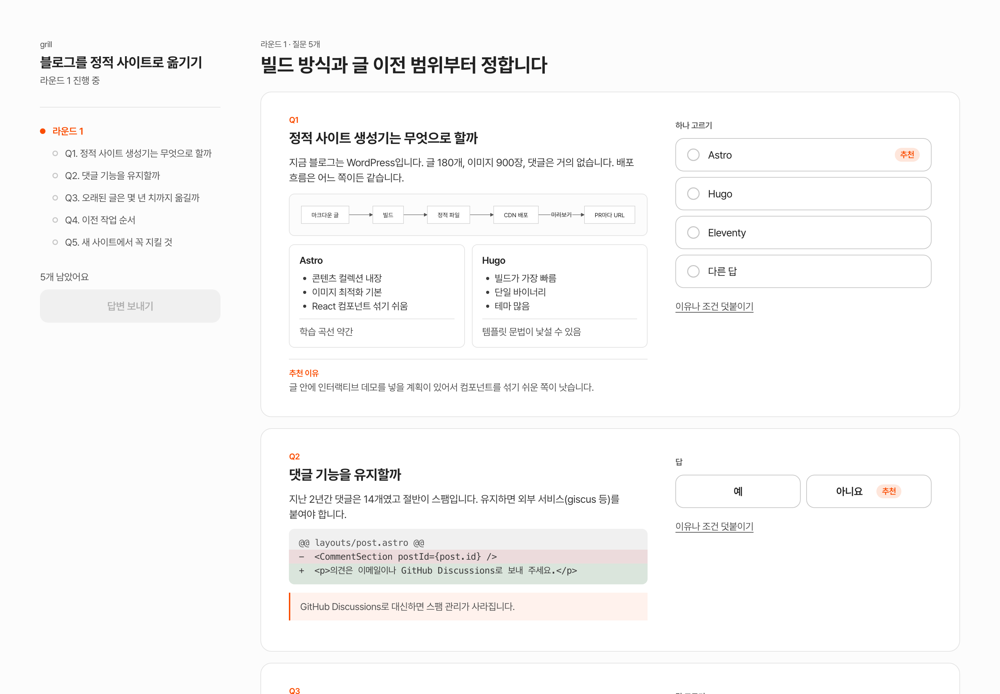
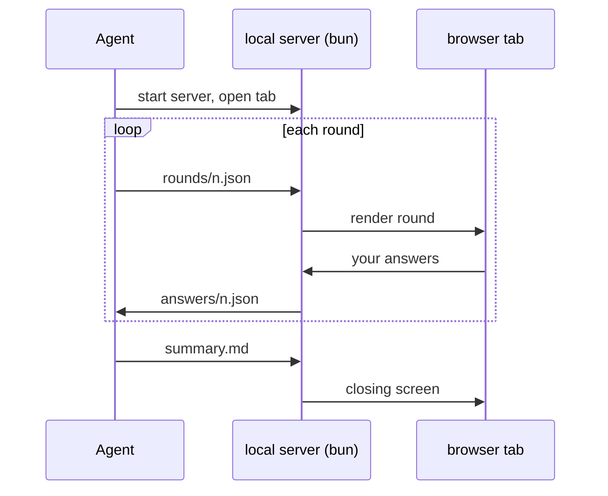

<h1 align="center">grill-web</h1>

<p align="center">
  <b>Get grilled about your plan in a browser, not a terminal.</b><br>
  A rounds-based interview form for Claude Code, built on Matt Pocock's <a href="https://github.com/mattpocock/skills/blob/main/docs/productivity/grilling.md">grilling</a> skill.
</p>

<p align="center">
  English · <a href="README.ko.md">한국어</a>
</p>



You have a plan. It has holes you can't see yet. `grilling` finds them by interviewing you round after round until nothing is left silently assumed. It's excellent, and answering it in a terminal is painful: scroll up to reread Q7, type an essay about Q3 into a one-line prompt, repeat.

grill-web keeps the interview and throws out the terminal. Questions open in a browser tab. You click the answer, add a note if you want, hit send. The agent computes the next round.

## What you get

**Click, don't type.** Yes/no toggles, single and multiple choice, a slider for numbers, a text box only when words are really needed. The skill has the agent attach a recommended answer to every question, and you can take it with one click.

**Questions that show, not tell.** The agent can put a mermaid diagram, a side-by-side comparison, a diff, a step list or a table right inside the question. Deciding between two architectures is easier when both are drawn.

**Room to explain yourself.** Each answer has an optional note. "Yes, but only if we keep the old URLs" is a real answer, and the agent folds it into the next round.

**Light on context.** The page is built once and never regenerated. Per round, the agent writes one small JSON file and reads one back, so the interview's output side stays small no matter how long it runs.

**Built for wide screens.** Question on the left, answer on the right, previous rounds folded below. On a narrow window they stack vertically.

**Skip and come back.** Not sure yet? Put a question off with one click. It comes back in a later round, marked as deferred, once the answers around it have settled.

**Take it with you.** Copy the whole session as markdown at any point. Paste it into a spec, a ticket, or another agent.

## Quick start

This is a skill for [Claude Code](https://claude.com/claude-code). You also need [bun](https://bun.sh) (the local server runs on it) and the [grilling](https://github.com/mattpocock/skills) skill.

```bash
# 1. grilling, once. Either of these works; pick the one you use for other skills.
npx skills@latest add mattpocock/skills --skill grilling
#    or, inside Claude Code:  /plugin install mattpocock-skills

# 2. grill-web
npx skills@latest add korECM/grilling-web
#    or, inside Claude Code:  /plugin marketplace add korECM/grilling-web
#                             /plugin install grill-web@grilling-web
```

Then, in Claude Code:

```
/grill-web grill my plan to move the blog to a static site
```

A tab opens with round one. Answer, send, repeat. When there is nothing left to ask, the agent checks one last thing, "do we share the same understanding?", and if you say yes it writes the summary onto the closing screen.

Starting a new session wipes the previous one. Copy the markdown first if you want to keep it.

## How it works

grill-web is a thin layer over grilling. The interview logic is untouched; only the channel changes.



Everything stays on your machine. State lives in `~/.cache/grill-web/`, the server listens on port 4747 (`GRILL_WEB_PORT` and `GRILL_WEB_DIR` to change), and nothing leaves except the CDN requests for the font and mermaid.

## FAQ

**Does it change how grilling asks questions?**
No. It loads grilling first and follows its rules: map the topic as a tree of decisions, ask everything that can be asked right now in one round, never answer a decision on the user's behalf, and confirm the shared understanding before doing anything. If grilling isn't installed, it tells you how to install it and stops.

**Can I use it without Claude Code?**
The form and server don't care who writes the JSON. Any agent that can read a SKILL.md and run a shell command can drive it. Only Claude Code has been tried so far.

**The UI is in Korean. Can I change it?**
Yes, the strings live in `ui/index.html`. The interview itself happens in whatever language you and the agent speak.

**The agent said it timed out waiting for me.**
The wait command gives up after about nine and a half minutes so the agent's shell call doesn't hang forever. Your answers are still there; the agent just runs the wait again.

**Why bun?**
One file, no `package.json`, starts in a blink. If you need Node, `server.ts` is small enough to port in an afternoon.

## Under the hood

For people who want to tweak the skill. The agent writes files like this; you never have to.

```json
{
  "intro": "Storage first",
  "questions": [
    {
      "n": 1,
      "title": "Where should retry state live?",
      "body": [
        "The orders table has no status column today.",
        { "type": "mermaid", "code": "flowchart LR\n  A[request] --> B{response}\n  B -->|5xx| C[retry]" },
        { "type": "compare", "columns": [
          { "title": "Add a column", "points": ["one migration"], "note": "no history" },
          { "title": "Separate table", "points": ["one row per attempt"] }
        ] }
      ],
      "kind": "choice",
      "options": ["Add a column to orders", "Separate retry table"],
      "recommendation": "Add a column to orders",
      "why": "One join fewer and a single migration."
    },
    { "n": 2, "title": "Retry interval", "kind": "range", "min": 1, "max": 60, "unit": "s", "recommendation": 5 }
  ]
}
```

Answers come back the same way:

```json
{
  "round": 1,
  "answers": [
    { "n": 1, "value": "Separate retry table", "note": "orders already has 40 columns" },
    { "n": 2, "value": 10, "note": "" }
  ]
}
```

Question kinds: `yesno`, `choice`, `multi`, `range`, `text`. Body blocks: markdown, `mermaid`, `table`, `diff`, `compare`, `steps`, `callout`, `img`, plus `svg` and `html` as escape hatches. The full contract is in [skills/grill-web/SKILL.md](skills/grill-web/SKILL.md).

```
skills/grill-web/
  SKILL.md         rules and schema. What the agent reads
  ui/index.html    the form. One file, zero dependencies
  ui/server.ts     bun server. Serves the form, relays files, blocks on `wait`
```

## License

MIT
